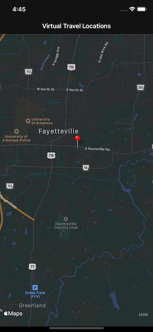

# VirtualTourist-iOS
Virtual Tourist is an app that allows you to drop a pin on a location and view a collection of photos from Flickr that were taken near that location. This app was created from scratch to meet specifications for my final project in the Data Persistence course as part of my iOS Developer Nanodegree from Udacity.

## Screenshots
| Home| Image Collection |
| ----------------- |  ----------------- |
|   |   |

## Frameworks Used
- Foundation
- UIKit
- CoreData
- MapKit

## Third-Party Frameworks Used
- [Alamofire-SwiftyJSON](https://github.com/SwiftyJSON/Alamofire-SwiftyJSON)
- [Toast-Swift](https://github.com/scalessec/Toast-Swift)

## Instructions

### Home (Map) Screen:
- Zoom into a location on the map
- Tap and hold to drop a pin
- Tap on the pin you just dropped (or an existing pin you have previously dropped) to be taken to the Image Collection screen

### Image Collection Screen:
- Scroll thru the image collection to view photos from the area
- Tap a photo to delete it from the collection
- Tap "New Collection" to clear the image collection and download a new set of images from the pin area